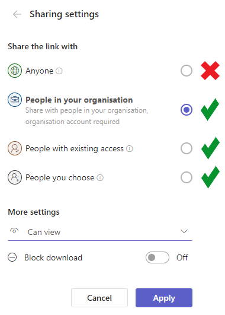

# stats-library
A collection of resources curated by the AIMS stats team.

[**View the library here!**](https://open-aims.github.io/stats-library/)


## Adding resources

To add resources to the library, you just need to update `stat_lib.bib` with the respective bibtex entry and push it back to Github. 

While it is fine (and probably preferrable) to include many bibtex fields, we only require the following fields for this Github Pages site to function properly. Please ensure you complete the following fields for each new resource:

```
@<resource type>{<bibtex ID>,
  author = {<author names>},
  title =	{<resource title>},
  year = {<YYYY>},
  doi =	{<DOI>},
  abstract = {<article abstract>},
  url =	{<link to resource online>},
  UPLOADER = {<your first name>}, 
  AIMS_URL = {<link to file on AIMS sharepoint>},
  SYNOPSIS = {<summary/notes/description/remarks about the resource>}
}
```

Note the custom fields in ALL CAPS - these will not be present in an ordinary bibtex entry and you will have to add them yourself. If you can't be bothered writing the synopsis, it would be good to at least have the abstract field present.

###  **Important!!** File access restriction

When copying the link to the resource on the AIMS sharepoint please ensure you restrict access to some option other than 'anybody with link' and that by sharing the file (even internally) you are not violating copyright or confidentiality. 

Please don't let this discourage you from adding resources to the library. If you are unsure/uncomfortable sharing the file, the link to the resource online (bibtex field `url`) is sufficient.




### Example bibtex entry

```
@article{Kruschke2021,
  author = {Kruschke, John K.},
  title	= {Bayesian Analysis Reporting Guidelines},
  journal = {Nature Human Behaviour},
  year = 2021,
  volume = 5,
  number = 10,
  month	= {Aug},
  pages	= {1282–1291},
  issn = {2397-3374},
  doi	= {10.1038/s41562-021-01177-7},
  url	= {http://dx.doi.org/10.1038/s41562-021-01177-7},
  publisher = {Springer Science and Business Media LLC},
  UPLOADER = {Brendan},
  AIMS_URL = {https://aimsgovau-my.sharepoint.com/notareallink},
  SYNOPSIS = {A go-to guide for the robust reporting of Bayesian analyses.}
}
```


## To Do: 

* Add abstract to dropdown if synopsis isn't present